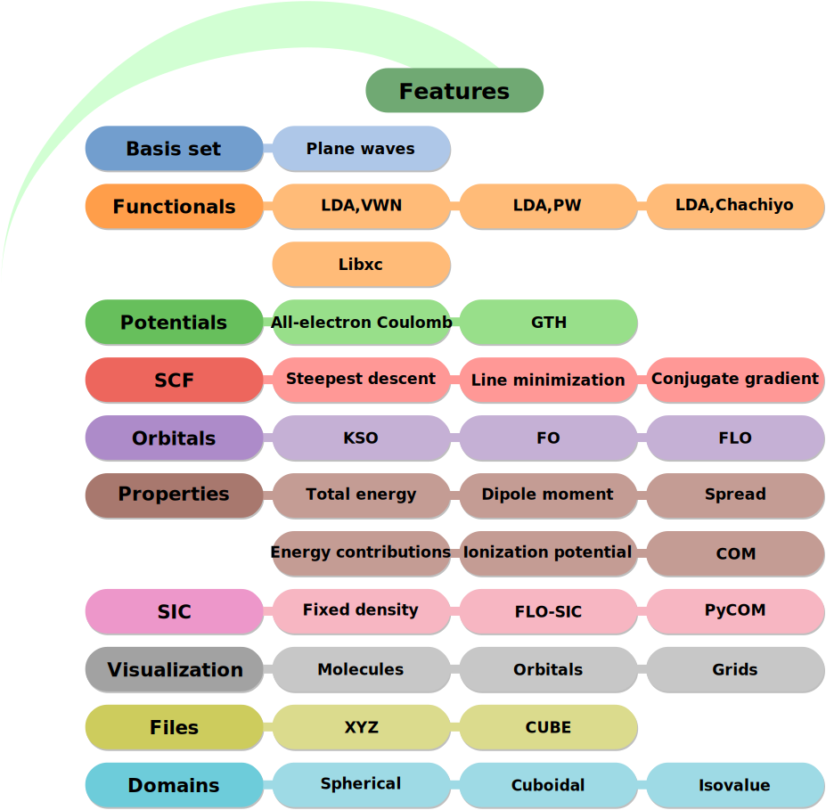

.. _introduction:

Introduction
************

.. image:: https://img.shields.io/pypi/v/eminus?color=1a962b
   :target: https://pypi.org/project/eminus

.. image:: https://img.shields.io/badge/language-Python3-green
   :target: https://www.python.org

.. image:: https://img.shields.io/badge/license-APACHE2-lightgrey
   :target: https://gitlab.com/wangenau/eminus/-/blob/main/LICENSE

.. image:: https://gitlab.com/wangenau/eminus/badges/main/coverage.svg
   :target: https://gitlab.com/wangenau/eminus/-/graphs/main/charts

.. image:: https://zenodo.org/badge/431079841.svg
   :target: https://zenodo.org/badge/latestdoi/431079841

eminus is a plane wave density functional theory (DFT) code with self-interaction correction (SIC) functionalities.
The goal is to create a simple code that is easy to read and easy to extend while using minimal dependencies.
It is built upon the `DFT++ <https://arxiv.org/abs/cond-mat/9909130>`_ pragmas proposed by Tomas Arias et al. that aim to let programming languages and theory coincide.
This can be shown by, e.g., solving the Poisson equation. In the operator notation of DFT++ the equation reads

.. math::

   \boldsymbol \phi = 4\pi\hat L^{-1}\hat O\hat J \boldsymbol n.

The corresponding Python code (implying that the operators have been implemented properly) reads

.. code-block:: python

   phi = -4 * np.pi * Linv(O(J(n)))

Feature overview
================

How to cite
===========

The project has been published with `Zenodo <https://doi.org/10.5281/zenodo.5720635>`_ and has an assigned DOI. The following BibTeX key can be used

.. code-block:: TeX

  @Misc{Schulze2021,
   author    = {Wanja Timm Schulze and Kai Trepte and Sebastian Schwalbe},
   title     = {eminus},
   year      = {2021},
   month     = nov,
   doi       = {10.5281/zenodo.5720635},
   publisher = {Zenodo},
  }
